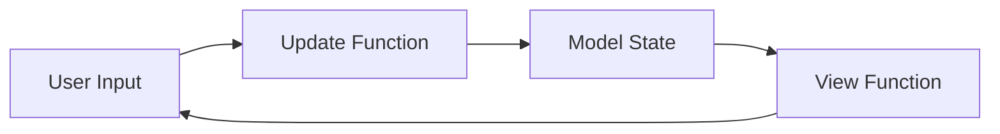
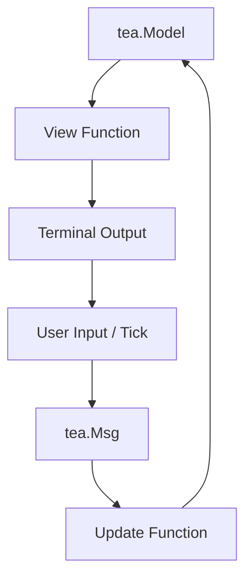

## Introduction

The Matrix rain effect—those iconic cascading green characters from the 1999 film—has become a visual staple of cyberpunk aesthetics. In this tutorial, we'll build a terminal application that displays the Matrix effect using actual text content instead of random symbols.

This project was created with [opencode](https://opencode.ai), an AI coding assistant. Most of the implementation was generated by opencode—we orchestrated the high-level design and observed the code being written. Our role was guiding the vision and testing the results.

Here's what the final result looks like in action, and here's what we'll cover:

- The Elm Architecture (the foundation Bubble Tea is built on)
- A minimal 25-line example showing how menus work in Bubble Tea
- Building the Matrix effect step by step
- Go's `//go:embed` directive for shipping assets in a single binary

---

## Understanding the Elm Architecture

Before diving into code, let's understand the mental model behind Bubble Tea. The Elm Architecture is a pattern for building user interfaces that originated in Elm (a functional programming language) and has since been adopted by many frameworks including Redux in React.

At its core, the Elm Architecture consists of three parts:



1. **Model** — The complete state of your application. In Go, this is a struct containing all the data needed to render your UI.

2. **View** — A function that transforms your Model into something the user can see (in our case, terminal output).

3. **Update** — A function that processes user actions (keypresses, timers, etc.) and returns a new Model along with any commands to run.

This is a radical departure from traditional imperative UI programming. Instead of mutating state directly, every interaction produces a new model. This makes applications easier to reason about and test.

Bubble Tea brings this pattern to Go terminal applications. Every Bubble Tea program follows this cycle:



---

## A Minimal Example: Building a Menu

Let's start with a concrete example. The following is a complete, self-contained 25-line Bubble Tea program that displays a selectable menu:

```go
package main

import (
	"fmt"
	"io"

	"github.com/charmbracelet/bubbles/list"
	tea "github.com/charmbracelet/bubbletea"
	"github.com/charmbracelet/lipgloss"
)

var itemStyle = lipgloss.NewStyle().Foreground(lipgloss.Color("245"))
var selectedItemStyle = itemStyle.Copy().Foreground(lipgloss.Color("86")).Bold(true)

type item struct{ title string }

func (i item) FilterValue() string { return "" }

type itemDelegate struct{}

func (d itemDelegate) Render(w io.Writer, m list.Model, index int, listItem list.Item) {
	i := listItem.(item)
	str := fmt.Sprintf("%d. %s", index+1, i.title)
	if index == m.Index() {
		fmt.Fprint(w, selectedItemStyle.Render("> "+str))
	} else {
		fmt.Fprint(w, itemStyle.Render(str))
	}
}

func main() {
	items := []list.Item{item{title: "Matrix"}, item{title: "Rain"}, item{title: "Effect"}}
	l := list.New(items, itemDelegate{}, 0, 0)
	l.SetShowStatusBar(false)
	l.SetFilteringEnabled(false)
	p := tea.NewProgram(struct{ list.Model }{l})
	p.Run()
}
```

This example demonstrates several key Bubble Tea concepts:

### The Item Type

```go
type item struct{ title string }
```

In Bubble Tea, list items must implement the `list.Item` interface. This interface requires two methods: `FilterValue() string` and `Description() string`. Even if filtering isn't needed, the interface must be satisfied—we return an empty string for `FilterValue()`.

### The Delegate

```go
type itemDelegate struct{}
```

A delegate controls how list items are rendered. The `Render` method receives the terminal writer, the list model, the item index, and the item itself. We use type assertion (`listItem.(item)`) to convert the generic `list.Item` back to our concrete `item` struct.

### Styling

```go
var itemStyle = lipgloss.NewStyle().Foreground(lipgloss.Color("245"))
```

Lipgloss is Bubble Tea's styling library. It provides a fluent API for styling terminal output with colors, bold text, and more.

---

## From Menu to Matrix Effect

Now that we've seen the basics, let's build up to the full Matrix effect. We'll start with the foundational pieces and work our way up.

### Step 1: Embedding Assets

First, we need a way to include text files in our binary. Go's `//go:embed` directive embeds files at compile time:

```go
//go:embed assets/*.txt
var assetsFS embed.FS

func readAsset(filename string) (string, error) {
	data, err := assetsFS.ReadFile(filename)
	if err != nil {
		return "", err
	}
	return string(data), nil
}
```

This uses two Go features:
- The `//go:embed` directive, a special compiler pragma
- The `embed` package from the standard library, which provides the `embed.FS` type (a virtual filesystem)

The result is a single binary containing all text assets. No external files to distribute.

### Step 2: The Model

Our application state needs to track:

```go
type model struct {
	list.Model                    // Embed the menu list
	columns    []column           // Rain columns
	width      int                // Terminal width
	height     int                // Terminal height
	viewing    bool               // Are we showing the effect?
	sourceText string             // Text to display
	runes      []rune             // Pre-processed characters
}

type column struct {
	x      int  // Horizontal position
	height int  // Column length
	offset int  // Position in source text
}
```

Note the use of `[]rune` instead of `[]byte` or `string`. In Go, a `rune` represents a Unicode code point. This is critical for handling multi-byte characters like emojis, Chinese characters, or accented letters. Using string indexing directly would break on anything beyond ASCII.

### Step 3: The Update Loop

The update function handles two kinds of messages: list navigation and animation ticks:

```go
func (m model) Update(msg tea.Msg) (tea.Model, tea.Cmd) {
	switch msg := msg.(type) {

	case tickMsg:
		if m.viewing {
			m.updateColumns()
			return m, tick()
		}

	case tea.KeyMsg:
		if msg.String() == "enter" && !m.viewing {
			m.viewing = true
			m.initializeColumns()
		}
	}

	// Delegate other messages to the embedded list
	newList, cmd := m.Model.Update(msg)
	m.Model = newList
	return m, cmd
}
```

### Step 4: Animation Timing

Animation in Bubble Tea uses the `tea.Tick` function, which fires messages at regular intervals:

```go
type tickMsg time.Time

func tick() tea.Cmd {
	return tea.Tick(time.Millisecond*80, func(t time.Time) tea.Msg {
		return tickMsg(t)
	})
}
```

Every 80 milliseconds, this sends a `tickMsg`. The choice of 80ms (approximately 12 frames per second) was deliberate—initial testing at 60fps (16ms) caused excessive CPU usage. Terminal animations don't need cinema-quality frame rates.

The recursive pattern (`tick()` returns a command that schedules the next `tick()`) creates the animation loop. Each frame triggers the next.

### Step 5: Rendering the Rain

Rendering builds a 2D grid representing the terminal, then paints the rain columns onto it:

```go
func (m model) View() string {
	// Initialize grid with spaces
	grid := make([][]rune, m.height)
	for i := range grid {
		grid[i] = make([]rune, m.width)
		for j := range grid[i] {
			grid[i][j] = ' '
		}
	}

	// Paint rain columns
	for _, col := range m.columns {
		for row := 0; row < col.height && row < m.height; row++ {
			actualRow := m.height - 1 - row
			if actualRow >= 0 {
				charIndex := (col.offset + row) % len(m.runes)
				grid[actualRow][col.x] = m.runes[charIndex]
			}
		}
	}

	// Convert to string with colors
	var sb strings.Builder
	for _, row := range grid {
		for _, r := range row {
			if r == ' ' {
				sb.WriteRune(r)
			} else {
				sb.WriteString(greenStyle.Render(string(r)))
			}
		}
		sb.WriteRune('\n')
	}
	return sb.String()
}
```

The math `(col.offset + row) % len(m.runes)` wraps the text index, creating the infinite scrolling effect.

---

## Lessons Learned

**Single-binaries are worth it.** Embedding assets means users get a single executable. No PATH configuration, no missing files, no "it works on my machine" problems.

**Unicode requires attention.** Using `[]rune` throughout handles multi-byte characters correctly. String indexing breaks on anything beyond ASCII.

**The Elm Architecture clicks eventually.** At first, the message-update-model cycle feels foreign. But it makes testing easier and eliminates entire classes of bugs.

**Terminal performance is real.** What works on modern hardware may struggle on older laptops. 12fps is smooth enough for terminal animation while remaining CPU-friendly.

---

## Try It Yourself

```bash
git clone https://github.com/isopath/matrix.go
cd matrix.go
go run .
```

The full source code is available on GitHub. Fork it, swap in your own text files, experiment with colors—the best way to learn is by modifying.

---

**Where to go next?** Image-to-ASCII conversion using the same rain effect, or perhaps a Star Wars crawl-style text renderer. The Elm Architecture makes adding new features straightforward once the pattern is familiar.
